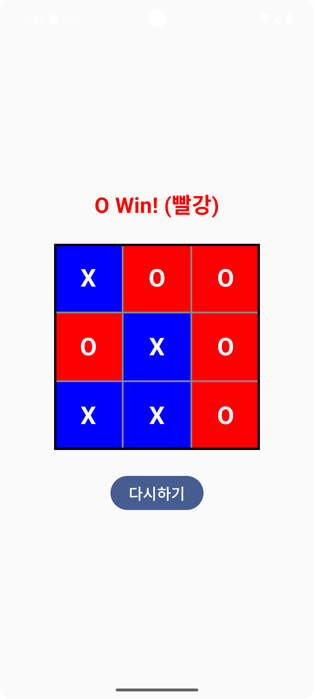
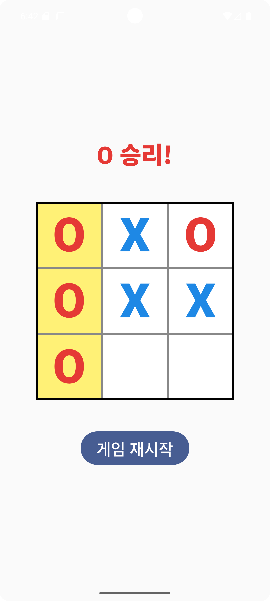

    
    

    
 
    <h2 style="border-bottom: 1px solid #21262d; color: #c9d1d9;">  </h2>  
    
  
 
    

    

    <h2 style="border-bottom: 1px solid #21262d; color: #c9d1d9;"> 🛠️ Tech Stacks </h2>   
    
 
          
          
          

    

 
 
🔴 🔵 Jetpack Compose 틱택토 (Tic-Tac-Toe) ver.2
"안드로이드 네이티브 UI 툴킷인 Jetpack Compose를 활용하여 구현한 2인용 틱택토 게임 프로젝트입니다. UI/UX 개선 및 반응형 디자인을 중점적으로 개발했습니다.
 
    

## 🌟 주요 기능

- **2인 플레이 (PvP):** X(파랑)와 O(빨강) 심볼을 사용한 2인 대전 모드.

- **실시간 승패 판정:** 8가지 승리 조건을 즉시 체크하고 결과를 표시.

- **무승부 판정:** 모든 칸이 채워지면 자동으로 무승부 처리.

- **승리 라인 하이라이트:** 승리 시 해당 3개의 칸을 강조하여 시각적 피드백 제공.

- **반응형 UI:** 게임 보드를 화면 중앙에 배치하여 모든 기기에서 최적화된 시인성 제공.

##  실행 화면 및 디자인 개선 (Before & After)

| 개선 전 (ver.1) | 최종 (ver.2 - 중앙 정렬 및 심볼 강조) | 승리 화면 |
| :---: | :---: | :---: |
|  |   |  |

*참고: ver.2는 중앙 정렬 및 X/O 심볼의 크기를 확대하여 직관적인 플레이 환경을 제공합니다.*
  
<개발 환경 설정>
 
가상화(VT-d) 이슈 해결:** BIOS 설정에서 가상화 기능을 활성화하여 에뮬레이터 구동 안정성 확보. 
Gradle/IDE 충돌 해결:** `Plugin error` 및 캐시 충돌(`프롤로그 오류`) 문제 해결 및 최적화.
 
 
  
